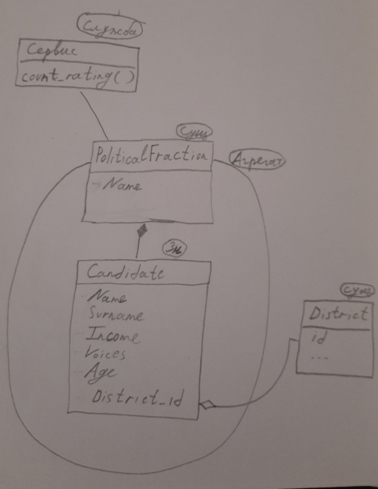

Министерство науки и высшего образования Российской Федерации  
Федеральное государственное бюджетное образовательное учреждение  
высшего образования  
«Московский государственный технический университет  
имени Н.Э. Баумана  
(национальный исследовательский университет)»  
(МГТУ им. Н.Э. Баумана)

ФАКУЛЬТЕТ ИНФОРМАТИКА И СИСТЕМЫ УПРАВЛЕНИЯ  
КАФЕДРА КОМПЬЮТЕРНЫЕ СИСТЕМЫ И СЕТИ (ИУ6)

 

ОТЧЕТ  
к лабораторной работе №4  
по дисциплине "Современные средства разработки  
программного обеспечения"  
Рефакторинг. Выделение
сущностей, значений и служб модели, изоляция ограниченного
контекста

 

Преподаватель: Фетисов М.В.

Студенты группы ИУ6-52Б Астахов Сергей Викторович, Лапшин Никита Валерьевич.

## Описание задания

Задача № 14 (карточка  "Выборы в муниципалитет"): 

Необходимо построить отчёт по распределению рейтинга партий для определения мест в Муниципалитет на основании результатов выборов их кандидатов в округах. Нужно учесть, что по какому-то округу выборы могут быть признаны недействительными и все результаты по этому округу учитывать не нужно.

## Адрес проекта

Проект хранится в репозитории по адресу: [https://bmstu.codes/lsx/mstd/iu6-5-2021/iu6-52b-svastakhov-nvlapshin/l4/](https://bmstu.codes/lsx/mstd/iu6-5-2021/iu6-52b-svastakhov-nvlapshin/l4/).

Описание классов хранится в репозитории по адресу: [https://lsx.pages.bmstu.codes/mstd/iu6-5-2021/iu6-52b-svastakhov-nvlapshin/l4/index.html](https://lsx.pages.bmstu.codes/mstd/iu6-5-2021/iu6-52b-svastakhov-nvlapshin/l4/index.html)

## Диаграмма классов агрегата PoliticalFraction

Диаграмма классов агрегата PoliticalFraction

## Выводы

В данной лабораторной работе были развиты навыки разработки в рамках подхода MDD, получены навыки оценки необходимых изменений при уточнении модели предметной области, работы с внешним репозиторием кода и сценарием непрерывной интеграции.
